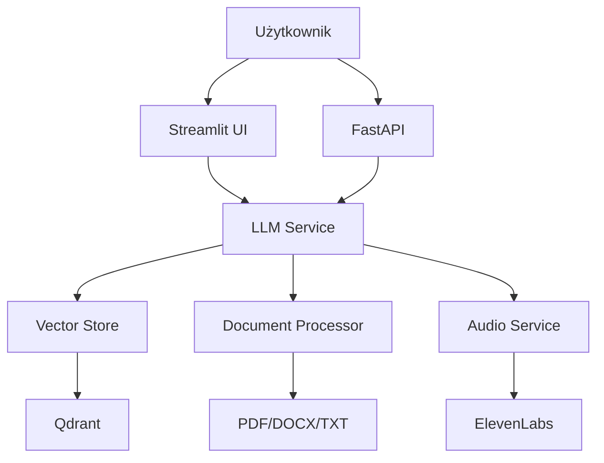

# SimplyBot - Inteligentny Chatbot RAG

[](https://python.org)
[](https://langchain.com)
[](https://fastapi.tiangolo.com)
[](LICENSE)

SimplyBot to zaawansowany chatbot wykorzystujący technologię **RAG (Retrieval-Augmented Generation)**, który łączy w sobie potęgę modeli językowych z możliwością wyszukiwania i analizy dokumentów.

## 🚀 Szybki Start

### Instalacja

```bash
# Klonowanie repozytorium
git clone https://github.com/your-username/SimplyBot.git
cd SimplyBot

# Instalacja zależności
pip install -r requirements.txt

# Konfiguracja zmiennych środowiskowych
cp env.example .env
# Edytuj .env i dodaj swoje API keys
```

### Uruchomienie

```bash
# Terminal 1: Uruchomienie API
uvicorn simplybot.main:app --reload --host 0.0.0.0 --port 8000

# Terminal 2: Uruchomienie interfejsu webowego
streamlit run simplybot/gui/streamlit_app.py
```

## 📚 Dokumentacja

### Uruchomienie dokumentacji lokalnie

```bash
# Instalacja zależności dokumentacji
pip install -r requirements-docs.txt

# Uruchomienie serwera dokumentacji
mkdocs serve

# Otwórz przeglądarkę i przejdź do: http://localhost:8000
```

### Budowanie dokumentacji dla GitHub Pages

```bash
# Budowanie statycznej strony
mkdocs build

# Sprawdzenie wygenerowanych plików
ls site/
```

### Wdrażanie na GitHub Pages

1. **Włącz GitHub Pages** w ustawieniach repozytorium
2. **Wybierz źródło**: "Deploy from a branch"
3. **Wybierz branch**: `gh-pages` (zostanie utworzony automatycznie)
4. **Wybierz folder**: `/ (root)`

Lub użyj GitHub Actions (zalecane):

```yaml
# .github/workflows/deploy.yml
name: Deploy to GitHub Pages
on:
  push:
    branches: [ main ]
  pull_request:
    branches: [ main ]

jobs:
  deploy:
    runs-on: ubuntu-latest
    steps:
    - uses: actions/checkout@v3
    - uses: actions/setup-python@v3
      with:
        python-version: 3.10
    - run: pip install -r requirements-docs.txt
    - run: mkdocs gh-deploy --force
```

## 🏗️ Architektura



## 🔧 Funkcjonalności

- **Przetwarzanie dokumentów** - PDF, DOCX, TXT
- **Wyszukiwanie semantyczne** - szybkie znajdowanie odpowiednich informacji
- **Konwersacja kontekstowa** - pamięć rozmowy i kontekst
- **Interfejs webowy** - intuicyjny UI w Streamlit
- **API REST** - pełne API do integracji
- **Synteza mowy** - konwersacja głosowa z ElevenLabs

## 📋 Wymagania

- Python 3.10+
- OpenAI API Key
- Qdrant (lokalnie lub w chmurze)
- ElevenLabs API Key (opcjonalnie)

## 🛠️ Technologie

- **LangChain** - Framework do budowania aplikacji AI
- **OpenAI GPT** - Model językowy do generowania odpowiedzi
- **Qdrant** - Baza danych wektorowa
- **ElevenLabs** - Synteza mowy
- **FastAPI** - Szybkie API REST
- **Streamlit** - Interfejs webowy

## 📖 Dokumentacja Online

Pełna dokumentacja dostępna jest pod adresem: [https://your-username.github.io/SimplyBot/](https://your-username.github.io/SimplyBot/)

### Sekcje dokumentacji:

- **[Wprowadzenie](https://your-username.github.io/SimplyBot/)** - O projekcie i funkcjonalnościach
- **[Architektura](https://your-username.github.io/SimplyBot/architecture/)** - Diagram i komponenty systemu
- **[Instalacja](https://your-username.github.io/SimplyBot/installation/)** - Wymagania i konfiguracja
- **[Użycie](https://your-username.github.io/SimplyBot/usage/)** - Jak korzystać z aplikacji

## 🤝 Współpraca

Zachęcamy do współpracy przy rozwoju projektu!

1. **Fork** repozytorium
2. **Utwórz branch** dla nowej funkcji (`git checkout -b feature/amazing-feature`)
3. **Commit** zmiany (`git commit -m 'Add amazing feature'`)
4. **Push** do branch (`git push origin feature/amazing-feature`)
5. **Otwórz Pull Request**

## 📄 Licencja

Projekt jest dostępny na licencji MIT. Szczegóły znajdziesz w pliku [LICENSE](LICENSE).

## 🆘 Wsparcie

- 📖 [Dokumentacja](https://your-username.github.io/SimplyBot/)
- 🐛 [GitHub Issues](https://github.com/your-username/SimplyBot/issues)
- 💬 [Discord](https://discord.gg/your-discord)
- 📧 [Email](mailto:your.email@example.com)

## ⭐ Gwiazdki

Jeśli projekt Ci się podoba, rozważ postawienie gwiazdki! ⭐

---

**SimplyBot** - Twój inteligentny asystent do analizy dokumentów i konwersacji AI.