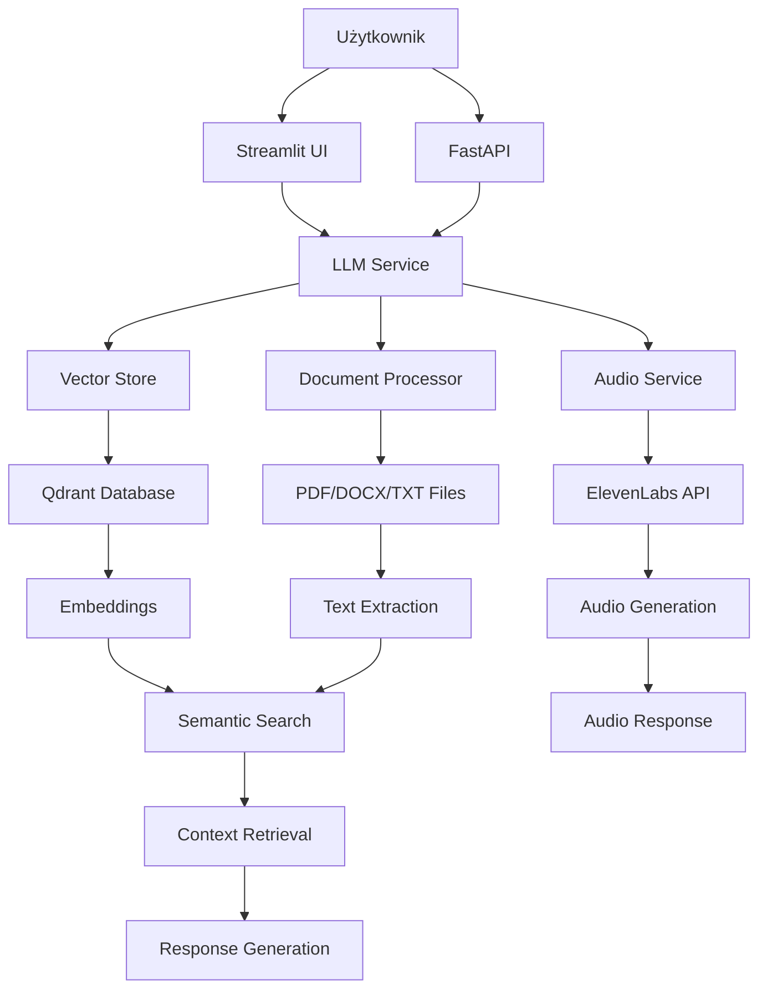

# Architektura SimplyBot

## Przegląd systemu

SimplyBot składa się z kilku głównych komponentów, które współpracują ze sobą, aby zapewnić funkcjonalność RAG chatbot.

## Diagram architektury

## Komponenty systemu

### 1. Interfejs użytkownika (Streamlit)
- **Lokalizacja**: `simplybot/gui/streamlit_app.py`
- **Funkcja**: Dostarcza webowy interfejs do interakcji z botem
- **Funkcjonalności**:
  - Upload dokumentów
  - Chat z botem
  - Generowanie audio
  - Podgląd statusu usług

### 2. API Backend (FastAPI)
- **Lokalizacja**: `simplybot/main.py`
- **Funkcja**: Główny serwer API obsługujący wszystkie żądania
- **Endpointy**:
  - `/get_more_information` - główny endpoint chatu
  - `/upload_documents` - upload dokumentów
  - `/generate-audio` - synteza mowy
  - `/documents/info` - informacje o dokumentach

### 3. Serwis LLM
- **Lokalizacja**: `simplybot/services/llm_service.py`
- **Funkcja**: Zarządza komunikacją z modelami językowymi
- **Obsługiwane modele**: OpenAI GPT, OpenRouter

### 4. Serwis Vector Store
- **Lokalizacja**: `simplybot/services/vector_store.py`
- **Funkcja**: Zarządza bazą danych wektorowej Qdrant
- **Funkcjonalności**:
  - Przechowywanie embeddings
  - Wyszukiwanie semantyczne
  - Zarządzanie kolekcjami

### 5. Serwis Document Processor
- **Lokalizacja**: `simplybot/services/document_processor.py`
- **Funkcja**: Przetwarza różne formaty dokumentów
- **Obsługiwane formaty**: PDF, DOCX, TXT

### 6. Serwis Audio
- **Lokalizacja**: `simplybot/services/audio_service.py`
- **Funkcja**: Generuje syntezę mowy
- **Dostawca**: ElevenLabs API

## Przepływ danych

1. **Upload dokumentu**: Użytkownik przesyła dokument przez UI
2. **Przetwarzanie**: Document Processor wyciąga tekst
3. **Embedding**: Tekst jest konwertowany na wektory
4. **Zapisywanie**: Wektory są zapisywane w Qdrant
5. **Pytanie**: Użytkownik zadaje pytanie
6. **Wyszukiwanie**: Vector Store znajduje podobne fragmenty
7. **Generowanie**: LLM generuje odpowiedź na podstawie kontekstu
8. **Audio** (opcjonalnie): ElevenLabs generuje mowę
9. **Odpowiedź**: Bot zwraca tekst i/lub audio 